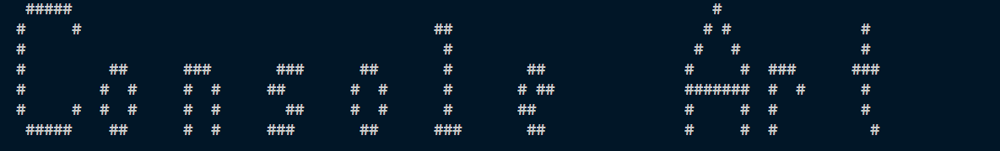

<div align="center">

<br/>
<br/>

</div>
	
----------

## Table of contents

- [Overview](https://github.com/codewithnick/ascii-art#overview)
- [Usage](https://github.com/codewithnick/ascii-art#Usage)
  - [Seven Star](https://github.com/codewithnick/ascii-art#1-Seven-Star)
  - [Boomer](https://github.com/codewithnick/ascii-art#2-Boomer)
  - [Carlos](https://github.com/codewithnick/ascii-art#3-Carlos)
  - [Straight](https://github.com/codewithnick/ascii-art#4-Straight)
  - [Starwar](https://github.com/codewithnick/ascii-art#5-Starwar)
- [Contribution](https://github.com/codewithnick/ascii-art/blob/main/CONTRIBUTING.md)
- [Reference](https://github.com/codewithnick/ascii-art#Reference)
- [Authors](https://github.com/codewithnick/ascii-art#Authors)
- [Show Your Support](https://github.com/codewithnick/ascii-art#Show-your-support)

## Overview

ASCII-ART C++ Library 🚀 This is a C++ library for generating ASCII art in various fonts and styles. It is a port of the popular Python library of the same name.
<br/>
<br/>
Features 🎉 Supports a variety of fonts, including standard fonts, decorative fonts, and monospace fonts. ⭐ Allows users to print characters and letters in different styles, such as bold, italic, and underlined. 💥 Provides a simple and easy-to-use API. 🔨

## Usage


# `Ascii Functions` :
##  ` Ascii()` : default constructor sets font to [Banner](./Fonts/banner/banner.md) 
## `Ascii(const FontName &fontName)` : sets the font to given parameter {FontName is Enum}

## `Ascii.print(const std::string &s)` : prints the given text in the set font and proceeds to new line
## `Ascii.SetFont(const FontName &fontName)` : sets the font to given parameter

Example :   
    ```Ascii a = Ascii(banner)```
    </br>
    ```a.print("Console Art)"```  

<br/>
<strong>Result</strong>
<br/>
<br/>

<div align="center">

</div>

## Avaliable Fonts
### 1-[Seven star](./Fonts/SevenStar/sevenstar.md)

### 2-[Boomer](./Fonts/Boomer/boomer.md)

### 3-[Carlos](./Fonts/carlos/carlos.md)

### 4-[Straight](./Fonts/Straight/straight.md)

### 5-[Starwar](./Fonts/starwar/starwar.md)

## Reference

1. [Art 6.1](https://pypi.org/project/art/)
2. [Ascii Generator](https://ascii-generator.site/t/)

### This is cloned form [Ascii Art](https://github.com/codewithnick/ascii-art) by [code with nick](https://github.com/codewithnick) and further developed by me
## Authors

<!-- readme: collaborators -start -->
<table>
<tr>
    <td align="center">
        <a href="https://github.com/PranjalKhatri">
            
            <br />
            <sub><b>Pranjal Khatri</b></sub>
        </a>
    </td>

</tr>
</table>

## Show your support

<h3>Raise issues and help in further development</h3>

Give a ⭐ if you like this project !
